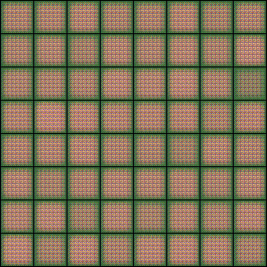
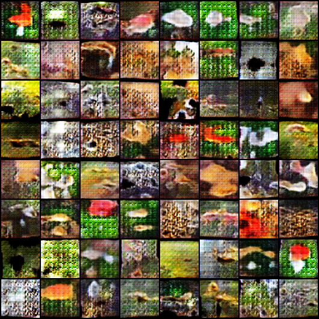
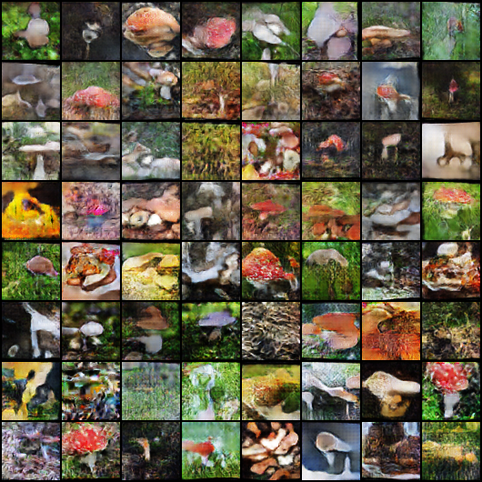
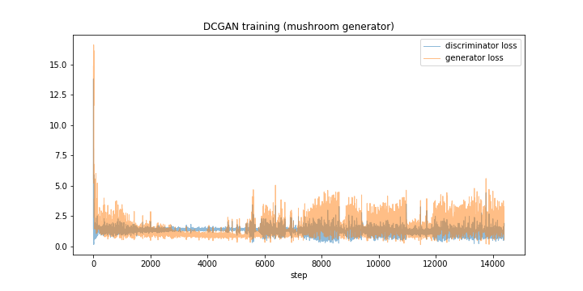

# 1. Train a DC-GAN to generate images of mushrooms
# 2. ???
# 3. Profit

Or, if the gif doesn't display properly

## Generated images at step 0
 

## Generated images at step 50

## Generated images at step 144

## Training losses

